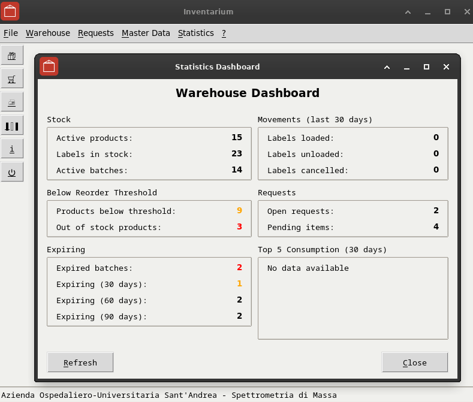

# Inventarium

A lightweight laboratory inventory management system built with Python and Tkinter.


## Overview

Inventarium is designed for small laboratory teams who need a simple, fast, and reliable way to track consumables, reagents, and supplies. No complex setup, no web server, no cloud dependencies - just a straightforward desktop application with a local SQLite database.

### Key Features

- **Product Hierarchy**: Products → Packages (SKUs) → Batches (Lots) → Labels (individual units)
- **Barcode Support**: Generate and scan barcodes for quick stock operations
- **Expiration Tracking**: FEFO (First Expired, First Out) management with alerts
- **Reorder Alerts**: Automatic notifications when stock falls below threshold
- **Request Workflow**: Create purchase requests and track deliveries
- **Statistics Dashboard**: Consumption analysis, rotation index, ABC classification
- **Multi-language**: Italian, English, and Spanish UI

## Screenshots


*Statistics Dashboard showing stock overview, reorder alerts, and expiration tracking*

## Installation

### Development Platform

Inventarium is developed and tested on **Linux Debian 12 (Bookworm)** with Python 3.11+.

### Production Environment

In our laboratory (Mass Spectrometry Lab, Sant'Andrea University Hospital, Rome), Inventarium runs on **4 Windows 10 workstations** as a standalone executable compiled with **Nuitka** and **Python 3.7**. The database is shared via network path on a folder called *"Spettri"* (Italian for both "spectra" and "ghosts" - fitting for a mass spec lab where inventory items occasionally... vanish 👻).

### Requirements

- Python 3.11 or higher
- Tkinter (usually included with Python on Linux)
- Virtual environment (venv)

On Debian/Ubuntu, ensure you have the required packages:
```bash
sudo apt install python3 python3-venv python3-tk
```

### Setup (Linux Debian 12)

1. **Clone the repository:**
```bash
git clone https://github.com/1966bc/inventarium.git
cd inventarium
```

2. **Create the virtual environment:**
```bash
python3 -m venv venv
```

3. **Activate the virtual environment:**
```bash
source venv/bin/activate
```
Your prompt should now show `(venv)` at the beginning.

4. **Install dependencies:**
```bash
pip install -r requirements.txt
```

5. **Run the application:**
```bash
python3 inventarium.py
```

### Quick Start (after first setup)

Every time you want to run Inventarium:
```bash
cd inventarium
source venv/bin/activate
python3 inventarium.py
```

### Setup (Windows)

1. Clone or download the repository
2. Open Command Prompt in the project folder
3. Create and activate virtual environment:
```cmd
python -m venv venv
venv\Scripts\activate
```
4. Install dependencies and run:
```cmd
pip install -r requirements.txt
python inventarium.py
```

## Database

Inventarium uses SQLite - a single file database that requires no server setup. The demo database (`sql/inventarium.db`) includes sample data to get you started.

### Demo Data

The included database contains fictional data for testing:
- 15 products (solvents, standards, columns, consumables)
- 6 suppliers (Sigma-Aldrich, Thermo Fisher, etc.)
- Sample batches, labels, and requests

To reset to demo data:
```bash
sqlite3 sql/inventarium.db ".read sql/demo_data.sql"
```

## Configuration

On first run, if `config.ini` is missing, a configuration dialog will appear to set the database path. The file is then created automatically.

You can also edit `config.ini` manually:

```ini
[database]
path = sql/inventarium.db
```

For shared network access, use a network path:
```ini
path = //server/share/inventarium.db
```

## Usage

### Main Workflow

1. **Add Products**: Define base products (e.g., "Acetonitrile HPLC Grade")
2. **Create Packages**: Link products to suppliers with specific packaging (e.g., "2.5L bottle from Sigma")
3. **Register Batches**: Add lot numbers with expiration dates
4. **Load Labels**: Create individual stock units (each gets a unique barcode)
5. **Unload Labels**: Scan or click to mark items as used

### Keyboard Shortcuts

- `Alt+N` - New
- `Alt+S` - Save
- `Alt+C` - Close/Cancel
- `Escape` - Close window

## Project Structure

```
inventarium/
├── inventarium.py      # Application entry point
├── app_config.py       # Configuration constants and functions
├── engine.py           # Core engine (combines all mixins)
├── dbms.py             # Database layer
├── controller.py       # Domain queries
├── tools.py            # Widget factories
├── i18n.py             # Translations
├── views/              # GUI windows
│   ├── main.py         # Main window
│   ├── config_dialog.py # First-run configuration
│   ├── warehouse.py    # Inventory management
│   ├── products.py     # Product list
│   └── ...
├── reports/            # Report generators
├── sql/                # Database and queries
│   ├── inventarium.db  # SQLite database
│   └── demo_data.sql   # Sample data
└── images/             # Application icons
```

## Architecture

The application uses a **mixin-based architecture** where the Engine class combines:

- `DBMS` - Database connection and query execution
- `Controller` - Domain-specific queries
- `Tools` - Tkinter widget factories
- `Launcher` - Cross-platform file opener

All views access the engine via `self.engine = self.nametowidget(".").engine`.

## Build Standalone Executable (Windows)

To create a standalone `.exe` that runs without Python installed:

```cmd
build_on_windows.cmd
```

**Requirements:**
- Python 3.7+
- Nuitka (`pip install nuitka`)
- MinGW64 (downloaded automatically by Nuitka if missing)

The executable is created in `dist\inventarium.dist\`. Copy the entire folder to distribute.

## Contributing

Contributions are welcome! Please feel free to submit issues or pull requests.

## License

This project is licensed under the GNU General Public License v3.0 - see the [LICENSE](LICENSE) file for details.

## Authors

**Giuseppe Costanzi** ([@1966bc](https://github.com/1966bc))

**HAL 9000** ([Claude](https://claude.ai) by [Anthropic](https://anthropic.com))

---

*Built with Python, Tkinter, and SQLite. Keep it simple.*
